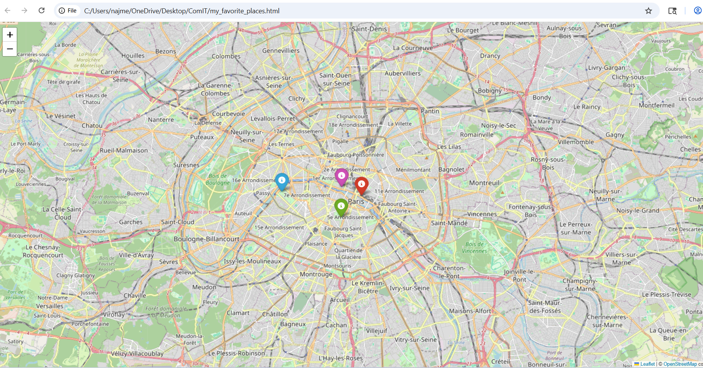

# EZ-Exercise
# My Favorite Places Map 🗺️

This project is an Object-Oriented Programming (OOP) exercise using Python and Folium.

## Features
* **Encapsulation:** Used in the `Place` base class.
* **Inheritance:** `Museum`, `Restaurant`, and `Park` classes inherit from `Place`.
* **Polymorphism:** Different marker colors and popup content for each type.

## Preview

## How to run
1. Install requirements: `pip install folium`
2. Run the script: `python ex.py`
